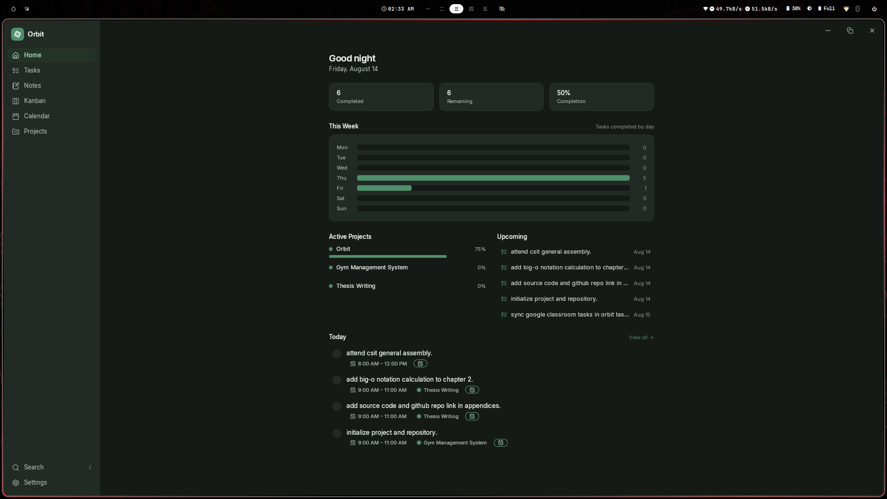
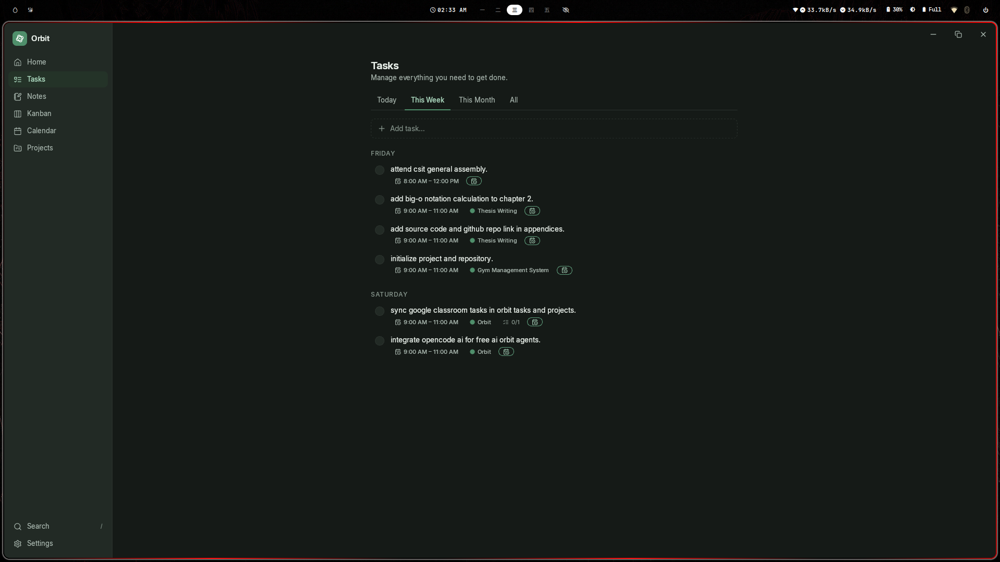
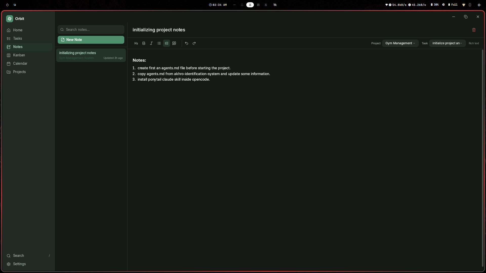
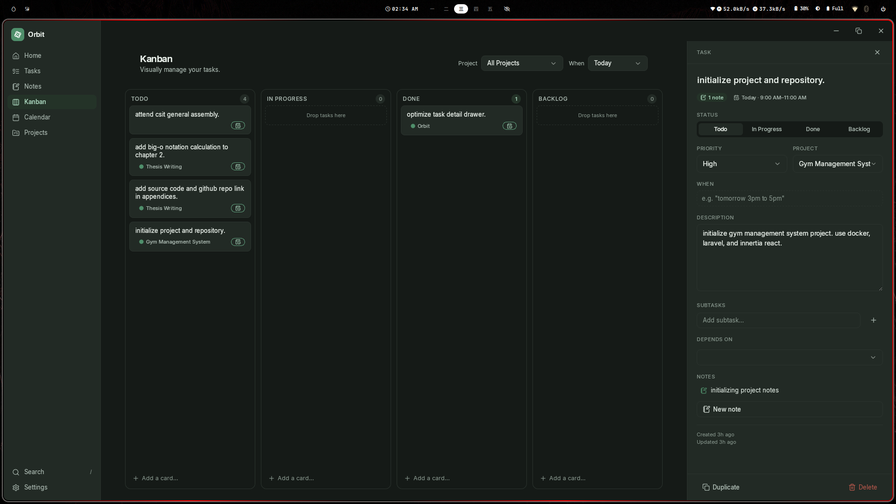
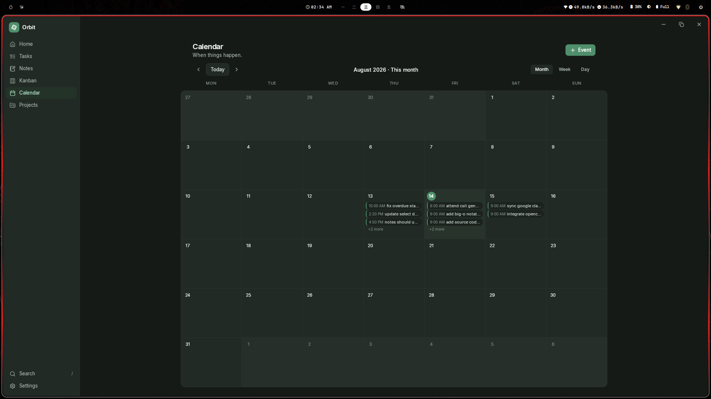
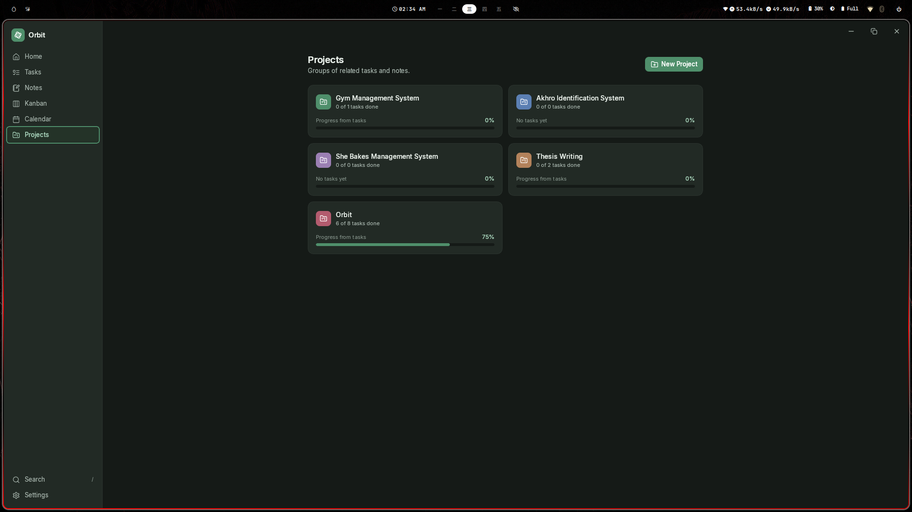
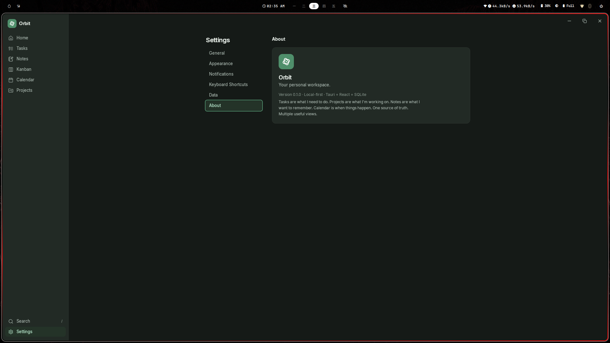

# Orbit — Your personal workspace

Orbit is a minimal, calming, **local-first** desktop application for managing
tasks, notes, projects, and time. Everything is stored in a local SQLite
database — no account, no cloud, no internet required.

> Tasks are what I need to do.
> Projects are what I'm working on.
> Notes are what I want to remember.
> Calendar is when things happen.

One source of truth. Multiple useful views.

## Screenshots

| Home | Tasks |
| ---- | ----- |
|  |  |

| Notes | Kanban |
| ----- | ------ |
|  |  |

| Calendar | Projects | Settings |
| -------- | -------- | -------- |
|  |  |  |

## Tech stack

- **Tauri 2** (Rust shell + SQLite via `tauri-plugin-sql`)
- **React 18 + TypeScript** (Vite)
- **Tailwind CSS v4** (calm green-and-white theme, light/dark/system)

## Development

```bash
npm install
npm run tauri dev
```

## Build

```bash
npm run tauri build
```

## Features (MVP)

- **Home** — dashboard with completion stats, weekly progress, active projects, upcoming tasks and events
- **Tasks** — Today / This Week / This Month / All tabs, quick add, inline rename, search + filters + sorting
- **Notes** — markdown editor with preview, search, project/task association
- **Kanban** — Todo / In Progress / Done / Blocked columns with drag-and-drop (updates real task status), project filter
- **Calendar** — month / week / day views; tasks and events share one record; drag to reschedule
- **Projects** — overview, tasks, notes, and an embedded kanban; progress derived automatically from tasks
- **Settings** — appearance, notifications, data export / import / backup, shortcut reference

## Keyboard shortcuts

| Keys | Action |
| ---- | ------ |
| `N` | New task |
| `Shift N` | New note |
| `/` or `Cmd K` | Search |
| `1`–`6` | Home / Tasks / Notes / Kanban / Calendar / Projects |

## Data

- Database: `sqlite:orbit.db` in Orbit's app-data directory
- Export: full JSON snapshot
- Backup: raw copy of the SQLite file
